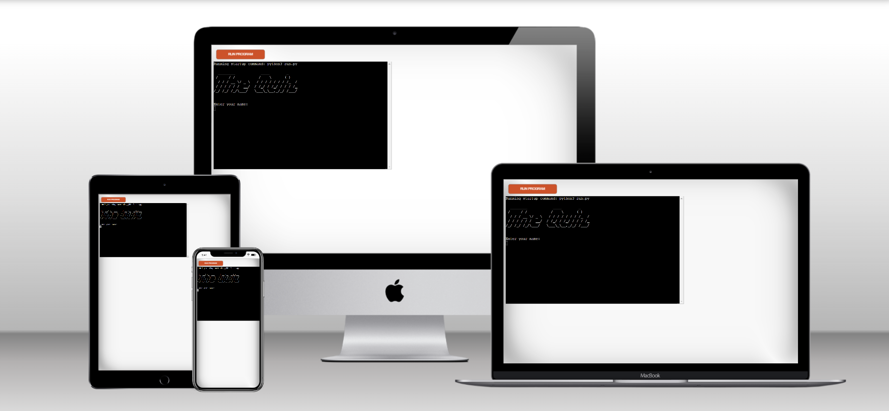

# The Quiz

# Description 
The objective of this project have a quiz, where the user can test their general knowlage. This quiz the user the option to choose between Easy, Medium or Hard question. the final result or score is storage into spreadsheet in google sheets.
ideas and code for this code has been part taken from tuorials found in youtube and Real Python website
The live site can be found here -[The Quiz](https://thequiz.herokuapp.com/)
# Table of Content
* Design
* Features
    * Existing Features   
* Testing
* Technologies Used
* Languages Used
* Frameworks, Libraries & Programs Used
* Deployment
* Credits
* Acknowledgments
# Design Diagram 

The quiz is a console base application, which doesnt need visual graphic design. Therefore, a layout has been design to show how the code should work. 
# Features
## Existing Features
some of the features of this project has been inpired by the love-Sandwich project.
where the quiz saved user and the score in a google spreadsheet.

* The quiz start as follows.

* The quiz app present a menu to choose the level of dificulties

* Once the level is selected, then it will show the questions

* For correct answers, will display the following

* For incorrect  or wrong answers, will display the following

* The leaderboard is updated with the user name and score

* If the user dont want to keep playing the following image will show

To show the leaderboard option 4 is selected and present

# Testing

* Code Validation
   * The python code has been tested by using PEP8 Online https://pep8ci.herokuapp.com/
     The validation program warned about long lines, blank spaces. However, this has been corrected and the code passes without any issues.
     
   
 * Bugs Fixed
   Cannot manage to saved in google spreadsheet the name of the player name only the score is being recorded.
    

* Fixed Bugs
  With the help of the tutor Joshua, we were able to get the player name saved in the spreadsheet bug was fixed.
   

# Technologies Used
## Main Languages Used
* Python
## Frameworks, Libraries & Programs Used
* Google spreadsheet
* Google Sheet API
* Google Drive API 
* Pyfiglet fonts 
* Colorama
* Time
* Click
* GitPod 
* Random
* Heroku - A data base use to deploy and storage the project. 

# Deployment
Before deployment, the requirement.txt needs to be created in the same folders as the .py file in Gitpod.
This is  the first file that Heroku will look for and contains the list of all libraries that is needed for the project app to be deploy in Heroku.

Steps to follow:

* 1-  Login to Heroku (Create an account if necessary)
* 2-  Click on New in the Heroku dashboard and select ”Create new app”
* 3-  Write a name for the app and choose your region and click ”Create App”
* 4-  In the settings tab for the new application created select the Config vars:
* 5-  In the config vars we will store the data that needS to be kept secret and is not deploy in Gitpod
   -  I create one named CREDS that contains the credentials key for Google Drive API
* 6-  Buildpack allows to create futher dependencies needed for the project. 
   -  The Buildpack added: Python and Nodejs (in that order)
* 7-  Once the buildpack has been added. Select the diploy tab
* 8-  In the deploy tab select Github, connect and search for the repository name that you want to deploy.
* 9-  Once choosed the repository, then connect to link the Heroku app to our repository code
* 10- There is two option: 
    - Enable automatic deploy  
    - Deploy branch (manual deploy)
* 11- Once one of the above option is select Heroku will prsent the link to our deploy site

The live link can be found [here](https://rhogand.github.io/    /)
# Credits
## Credits content
 For code inspiration, design, help and advice. I use the following website
* [Geeksforgeeks tutorial](https://www.geeksforgeeks.org/python-ascii-art-using-pyfiglet-module/) - Use of Pyfiglet fonts
* [Youtube video Multiple choice quiz using Class](https://www.youtube.com/watch?v=SgQhwtIoQ7o&ab_channel=MikeDane/)
* [Youtube video Google sheets and quiz](https://www.youtube.com/watch?v=SbKSiJy2WRo&ab_channel=DataBeliever/) 
* [Youtube video](https://www.youtube.com/watch?v=YScd9FqGAZs&ab_channel=TechWithStephen/) - Quiz using dictionary
* [Real Paython tutorial](https://realpython.com/python-quiz-application/#step-2-make-your-application-user-friendly/) - How to create a quiz in python
 ## Media
 # Acknowledgments
The site was completed as part of a Full Stack Software Developer Diploma at the Code Institute, Project 3. 
I would like to thank my mentor Mitko, who has been a great help in this project.